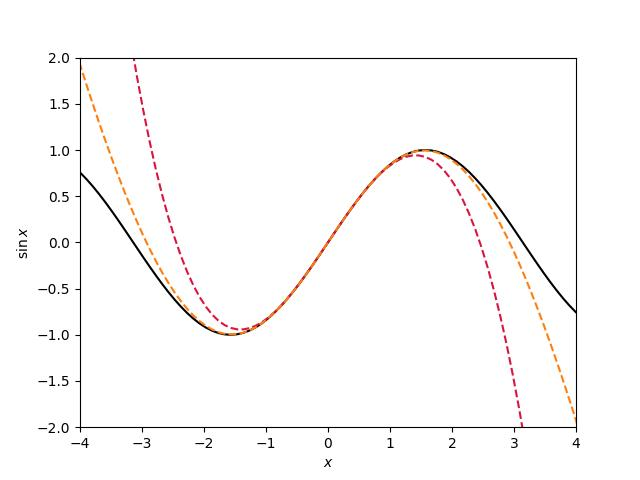

# Code for Globalizing manifold-based reduced models for equations and data

This repository contains the software implementation of the method outlined in the manuscript [1] which is concerned with globalizing the classical, Taylor series-based representations of invariant manifolds of dynamical systems. The Taylor series are usually obtained either by direct symbolic computations or using the state-of-the-art software package [SSMTool](https://github.com/jain-shobhit/SSMTool/tree/master), which carries out an automated computation of these Taylor series in high-dimensional systems. The notation and theory is explained in [2].

The implementation is based on uni- and multivariate Padé approximants as well as rational function regression. 


## Installation

1. Clone the repository with the command

```
git clone https://github.com/balintkaszas/globlaized-SSM.git
```

2. Install the dependencies with pip

``` 
cd gssm
pip install -r requirements.txt
```    
3. Install the package with 

```
pip install -e . 
```


## Basic usage 
A  ```TaylorSeries``` object represents the classical Taylor polynomial up to a predefined order. This can, for example, be initialized using an array of coefficients. 

```python
import numpy as np
import matplotlib.pyplot as plt
from taylor_to_pade.approximant import TaylorSeries, PadeApproximant
# define the Taylor coefficients of sin(x) and initialize a TaylorSeries object
sine_coeffs = [0, 1, 0, -1/6, 0, 1/120, 0, -1/5040]
sine_taylor = TaylorSeries(np.array(sine_coeffs), 3)
```

The ```PadeApproximant``` object can then be used to convert the Taylor series to a rational function representation through Padé approximants. 
```python
# initialize the PadeApproximant and convert the Taylor series
sine_pade = PadeApproximant(order_denominator = 3, order_numerator = 3)
sine_pade.initialize_from_taylor(sine_coeffs, use_robust=False)
# visualize 
sample_x = np.linspace(-5, 5, 100)
plt.plot(sample_x, np.sin(sample_x), '-', c='black')
plt.plot(sample_x, sine_taylor.evaluate(sample_x.reshape(-1,1)),'--', c='crimson')
plt.plot(sample_x, sine_pade.evaluate(sample_x.reshape(-1,1)), '--', c='C1')
plt.xlim(-4,4)
plt.ylim(-2, 2)
plt.xlabel('$x$')
plt.ylabel('$\sin x$')
```




A multivariate implementation is also available, as well as helper functions to interface with the Matlab files generated by SSMTool.

The ```examples/``` folder contains examples including

- a 1-dimensional invariant manifold in the Kolmogorov flow
- prediction of the forced periodic response of a forced von Karman beam featured in [2]
- prediction of the forced chaotic response of a von Karman beam in its buckled configuration featured in [3]
- Data-driven rational function regression to represent the two-dimensional SSM of an inverted flag experiment featured in [4]


## References

[1] B. Kaszás, & G. Haller, Globalizing manifold-based reduced models for equations and data, _submitted_, (2025).

[2] S. Jain & G. Haller, How to compute invariant manifolds and their reduced dynamics in high-dimensional finite-element models? Nonlinear Dyn (2021). 

[3] A. Liu, J. Axås & G. Haller, Data-driven modeling and forecasting of chaotic dynamics on inertial manifolds constructed as spectral submanifolds Chaos 34 (2024).

[4] Z. Xu, B. Kaszás, M. Cenedese, G. Berti, F. Coletti, G. Haller, Data-driven modeling of the regular and chaotic dynamics of an inverted flag from experiments J. Fluid Mech. 987 (2024).

